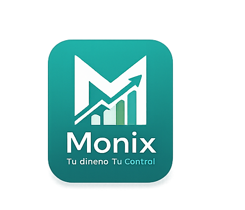

# 💎 Monix - Control Financiero Inteligente

**Monix** es una aplicación web ultra-premium diseñada para la gestión y control de finanzas personales con un enfoque quincenal. Construida con una estética de **Glassmorphism** y animaciones fluidas, Monix ofrece una experiencia de usuario "auténtica" y profesional.



## ✨ Características Principales

- 🚀 **Interfaz Premium:** Diseño moderno basado en "Melo Glassmorphism" con desenfoques de cristal, bordes de luz y capas de profundidad.
- 📊 **Dashboard Dinámico:** Visualización instantánea de Ingresos, Gastos, Saldo Disponible y Ahorro Recomendado (20%).
- 📅 **Control de Ciclos:** Gestión automatizada de periodos de 15 días con alertas de archivado.
- 📂 **Historial de Reportes:** Guarda y visualiza tus quincenas pasadas localmente.
- 📄 **Exportación a PDF:** Genera reportes profesionales y estéticos con un solo clic, incluyendo logo y estadísticas detalladas.
- 🔒 **Privacidad Local:** Tus datos nunca salen de tu dispositivo; se almacenan de forma segura en el `LocalStorage` de tu navegador.
- 🎭 **Animaciones Fluidas:** Experiencia interactiva potenciada por `Framer Motion`.

## 🛠️ Tecnologías Utilizadas

- **Core:** [React.js](https://reactjs.org/) + [Vite](https://vitejs.dev/)
- **Animaciones:** [Framer Motion](https://www.framer.com/motion/)
- **Iconografía:** [Lucide React](https://lucide.dev/)
- **Gráficos:** [Chart.js](https://www.chartjs.org/)
- **PDF:** [jsPDF](https://github.com/parallax/jsPDF) & [jsPDF-AutoTable](https://github.com/simonbengtsson/jsPDF-AutoTable)
- **Estilos:** CSS3 Custom Properties & Glassmorphism UI

## 🚀 Instalación y Uso

Para ejecutar Monix localmente, sigue estos pasos:

1. **Clonar el repositorio:**
   ```bash
   git clone https://github.com/tu-usuario/monix-financial.git
   cd monix-financial
   ```

2. **Instalar dependencias:**
   ```bash
   npm install
   ```

3. **Iniciar en modo desarrollo:**
   ```bash
   npm run dev
   ```

4. **Construir para producción:**
   ```bash
   npm run build
   ```


## 📄 Licencia

Este proyecto es de uso libre. Siéntete libre de clonarlo y adaptarlo a tus necesidades.

---
Hecho con ❤️ por [Tu Nombre] - **Monix Team**
